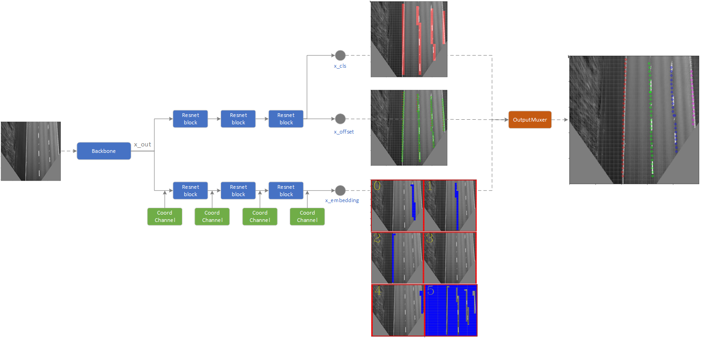
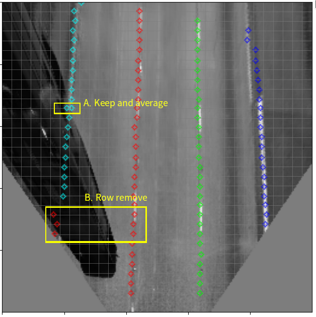

# Lane Detector implementation in Keras

## Contents
- [Lane Detector implementation in Keras](#lane-detector-implementation-in-keras)
  - [Contents](#contents)
  - [Overview](#overview)
  - [Dependencies](#dependencies)
  - [How to use it](#how-to-use-it)
    - [Training](#training)
    - [TF-Lite model convertion](#tf-lite-model-convertion)
    - [Test the model](#test-the-model)
    - [TODO](#todo)
    - [References](#references)

## Overview
A tensorflow learning project to create model for the real-time application about multi lane detector.
The goal of this project:
- Learn python and tensorflow
- Create a model for multi-lane detctor and custom dataset by tensorflow ops
- Convert to qunatized tf-lite model and try model inferencing at Qualcomm Hexagon DSP (Snapdragon 835/Hexagon 682) in real-time.

Instead detecting lane from source camera image, i try to transform image by perspective matrix first, and detect lane from perspective image.
The reasons to do that:
- Keep different camera type or camera installation have similar image style.
- Constraint the lane region of detection to reduce input image size of model.

<b>The main network architecture</b>:
 

- The input of model is perspective image, and the outputs are anchor offset, class prob and instance data called embeddings
- We split the input image as multiple anchors (n x n):
  - Each anchor responsible for data precting only if lane cross to it.
  - Predcited data would be offset of x, class prob and embeddings.
  - Each lane will have unique embedding index in one image for instance segmentation. see [link](https://arxiv.org/abs/1708.02551) for more details about  embeddings.

- Our model is created by:
  -  resnet block based model as backbone
  -  3 branchs as raw output for training:
     - <b>x_cls</b> : Class probability at each anchor that the lane or background.
     - <b>x_offsets</b> :  Offsets at each anchor (only x offset be cared)
     - <b>x_embeddings</b> : embedding data for instance segmentation.
  - <b>OutputMuxer</b> : A data muxter to mux raw outputs.

## Dependencies
- Tensorflow 2.4.0-dev20200815
- numpy
- opencv-python
- matplotlib

## How to use it

### Training
1. We use <b>"TuSimple Lane Detection Challenge"</b> dataset for training, please download dataset from [TuSimple github](https://github.com/TuSimple/tusimple-benchmark/tree/master/doc/lane_detection), and decompress as following directory structure:
  - ${DatasetsPath}/train_set/
    - clips/
    - label_data_0313.json
    - ...
  - ${DatasetsPath}/test_set
    - clips/
    - test_tasks_0627.json
    - ...

2. Modify the element <b>TuSimple_dataset_path</b> at config.json by your environment, 
3. run <b>train_tflite.py</b> for training

    > python3 train_tflite.py

### TF-Lite model convertion
Once the training finish, we must convert model as TF-Lite model for mobile platform. Please run <b>generate_tflite_model.py</b> to convert model, the converted model is named same as element <b>"tflite_model_name"</b> at config.json.

> python3 generate_tflite_model.py

<b>Note</b> : Even though tf-2.0 use new convertor(MLIR converter?) as default to convert tf-lite model, but our model will face many problem when convertng, such as convert finish but allocat_tensor error, or double Dequnatize node error. To go through the convertion for learning, i set converter.experimental_new_converter as False at Tensorflow 2.4.0-dev20200815

### Test the model
<b>test_tflite_model.py</b> is used to load and test converted tf-lite at previous step, this program will inference tf-lite model and rendering the result of inferencing.
> python3 test_tflite_model.py

The description about Post-processor is shown as following. In default, i set <b>with_post_process</b> as False to disable post-processor and rendering the default output. Enable this flag if you need post-process.

The goal of post-process step after inferencing is removing the data at rows where the variance of x offset large than threshold, such as following image with 32x32 anchors at 256x256 images, with post-process and threshold as 10 (pixel), anchors at area A will be reserved and averaged as final output. anchors at area B will be removed due to variance at row out of threshold

 

### TODO
- Model
  - Add curve fitting at post process
- Android
  - Open camera/video and get image data.
  - Implement perspective transformation by openGL/ES PBO to transform image for model inference
  - Rendering inference result

### References
- [Towards End-to-End Lane Detection: an Instance Segmentation Approach](https://arxiv.org/abs/1802.05591)
- [Semantic Instance Segmentation with a Discriminative Loss Function](https://arxiv.org/abs/1708.02551)
- [github : LaneNet-Lane-Detection](https://github.com/MaybeShewill-CV/lanenet-lane-detection)
- [github : SSD: Single-Shot MultiBox Detector implementation in Keras](https://github.com/pierluigiferrari/ssd_keras#overview)
- [github : Instance Segmentation with a Discriminative Loss Function](https://github.com/hq-jiang/instance-segmentation-with-discriminative-loss-tensorflow)

